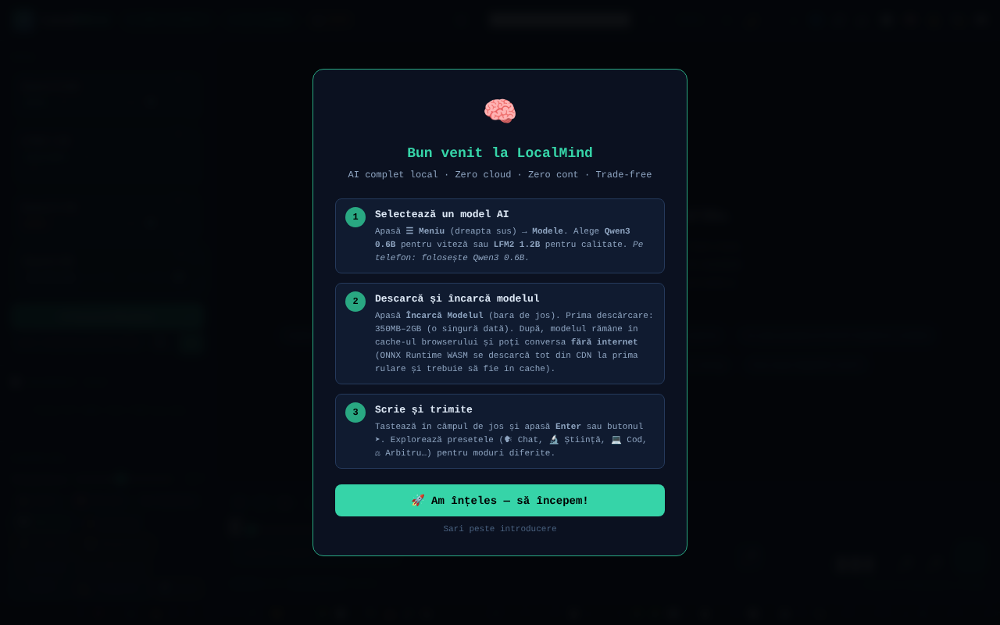

# LocalMind

Asistent AI care rulează în browser (transformers.js + WebGPU), fără cont și fără cheie API.

**Live:** https://chiuta.github.io/LocalMind/

## Ce este

LocalMind (v117 în titlul paginii) este o interfață de chat cu modele de limbaj care rulează local în browser, prin transformers.js v4.2.0 (WebGPU, cu alternativă CPU/WASM acolo unde este cazul). Alegi un model, apeși „Încarcă Modelul”, iar modelul se descarcă o singură dată de la Hugging Face și rămâne în cache-ul browserului. Interfața este în română, iar aplicația afișează insigne „ZERO TELEMETRY” și „NO ACCOUNT”.

## Funcții

- Modele predefinite: Qwen3 0.6B, LFM2 1.2B, Qwen3 1.7B, Qwen3 4B (dimensiuni afișate în interfață: ~550 MB, ~700 MB, ~1.3 GB, ~2.5 GB), plus „Descoperă modele ONNX” (căutare în catalogul Hugging Face) și o colecție curată.
- Chat cu streaming, istoric de conversații, ramuri/snapshot-uri, fuzionarea a două ramuri, comparare a două modele, bookmark-uri, căutare în conversație.
- Presetări de stil și de system prompt (Chat, Știință, Cod, Creativ, Română, Mate, Traducere, Rezumat, Socratic etc.), parametri (temperature, Top-P, penalizare de repetiție, max tokens), variabile `{{date}}`, `{{time}}`, `{{model}}`, `{{name}}`.
- Documente (RAG): încărcare TXT / MD / CSV / PDF (pdf.js local).
- Memorie persistentă, buget zilnic de tokeni, bibliotecă de prompturi (export/import JSON), temporizatoare (Pomodoro, Deep, Sprint), mod focus.
- Vizualizare conversație (mind map, diagramă), export TXT / MD / JSON / JSONL / PDF / HTML, export către Obsidian, Logseq, Notion, varianta anonimă.
- Randare Markdown, KaTeX și Mermaid (încărcate la nevoie), rulare de cod Python prin Pyodide (încărcat la nevoie).
- Dictare vocală și citire cu voce (API-urile browserului, acolo unde există), tastatură cu scurtături.
- „Audit Rețea”: panou care numără cererile de rețea făcute în timpul inferenței.
- Teme (luminos/întunecat, nocturn), mod Simplu, accesibilitate (mărime text, dislexie).

## Manual de utilizare

1. Deschide pagina într-un browser cu WebGPU (aplicația detectează dispozitivul în antet).
2. Alege un model din lista „Model” (de exemplu Qwen3 0.6B pentru pornire rapidă) și apasă „⬇ Încarcă Modelul”. Prima încărcare descarcă modelul de pe huggingface.co.
3. Scrie în câmpul de mesaj și trimite cu `Enter` (`Shift+Enter` pentru linie nouă). `Escape` oprește generarea.
4. Ajustează presetarea de stil, system prompt-ul și parametrii în panoul lateral.
5. Pentru documente, trage un fișier în zona „Documente (RAG)” sau fă click pe ea; activează „RAG activ”.
6. Salvează și exportă conversația din butoanele de export (sau `Ctrl+Shift+S`, `Ctrl+Shift+X`, `Ctrl+Shift+J`).
7. Scurtături utile: `?` fereastra de scurtături, `Alt+M` meniu, `Alt+S` modul Simplu, `Alt+N` modul nocturn, `Alt+L` temă luminoasă, `Alt+V` dictare, `Alt+C` conversație nouă, `Alt+H` istoric, `Alt+D` statistici, `Ctrl+F` caută, `Ctrl+B` salt la bookmark, `Alt+1–5` schimb rapid de model.
8. Deschide „Audit Rețea” pentru a vedea cererile de rețea din timpul generării.

## Confidențialitate și rețea

- **Stocare locală:** `localStorage` (chei cu prefixul `lm_`: preferințe, conversații salvate, bibliotecă de prompturi, memorie, buget, benchmark-uri etc.) și Cache Storage (modele descărcate de transformers.js și un service worker mic pentru resurse CDN). Textul conversațiilor nu este trimis nicăieri de aplicație.
- **Rețea (hosturi terțe):**
  - `huggingface.co` (și `*.huggingface.co`, `hf.co`): descărcarea modelelor ONNX și căutarea în catalog, doar când încarci un model sau cauți modele.
  - `cdn.jsdelivr.net`: KaTeX, Mermaid 11.15.0 și Pyodide 0.27.0, încărcate doar când sunt necesare (formule, diagrame, rulare de cod Python). Politica CSP din pagină permite doar aceste hosturi.
  - transformers.js și pdf.js sunt incluse local în folderul `vendor/` din repository.
- Aplicația afirmă „zero cereri de rețea în inferență”: după ce modelul este încărcat, generarea rulează local.

## Rulare locală / offline

Descarcă întregul director (nu doar `index.html`, deoarece scripturile transformers.js și pdf.js sunt în `vendor/`) și servește-l cu un server web local sau deschide `index.html`; unele funcții (module, service worker) funcționează mai bine prin `http://localhost`. Pentru prima utilizare a fiecărui model este nevoie de internet; după aceea modelul este în cache. KaTeX, Mermaid și Pyodide au nevoie de internet la prima folosire.

## Licență

CC0 1.0 Universal (domeniu public) — vezi fișierul LICENSE

## Autor

Alexio — Alexandru-Ionuț Chiuță, contact: alexio@trom.tf

## English summary

LocalMind is a browser-based chat UI for small language models (Qwen3, LFM2) running via transformers.js and WebGPU, with RAG over local documents, conversation branching, exports and a network audit panel. Models are downloaded once from huggingface.co; KaTeX, Mermaid and Pyodide load on demand from cdn.jsdelivr.net; transformers.js and pdf.js are vendored locally. Settings and chats live in localStorage (`lm_` keys). UI is Romanian.
